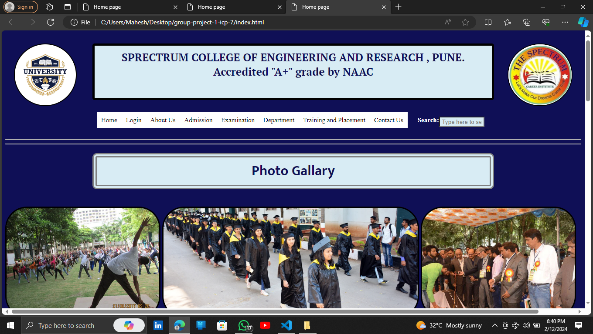
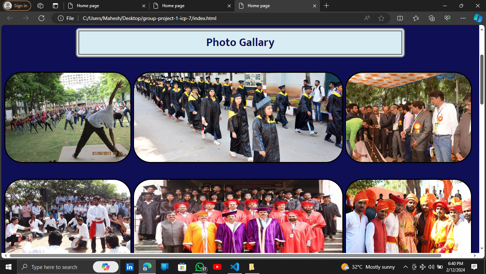
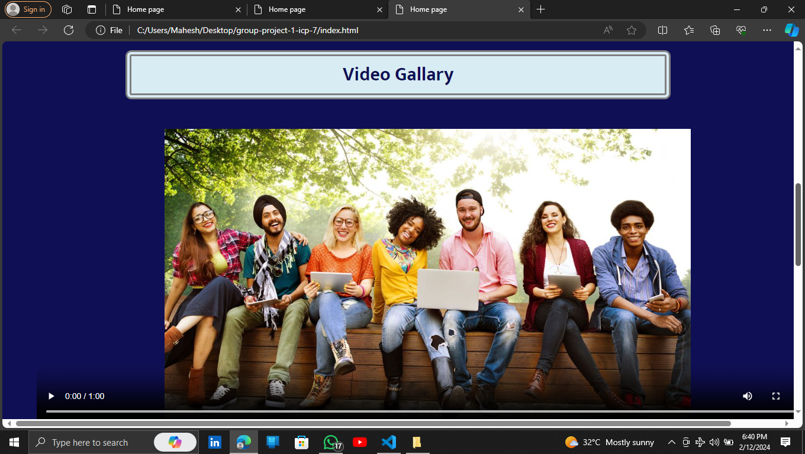
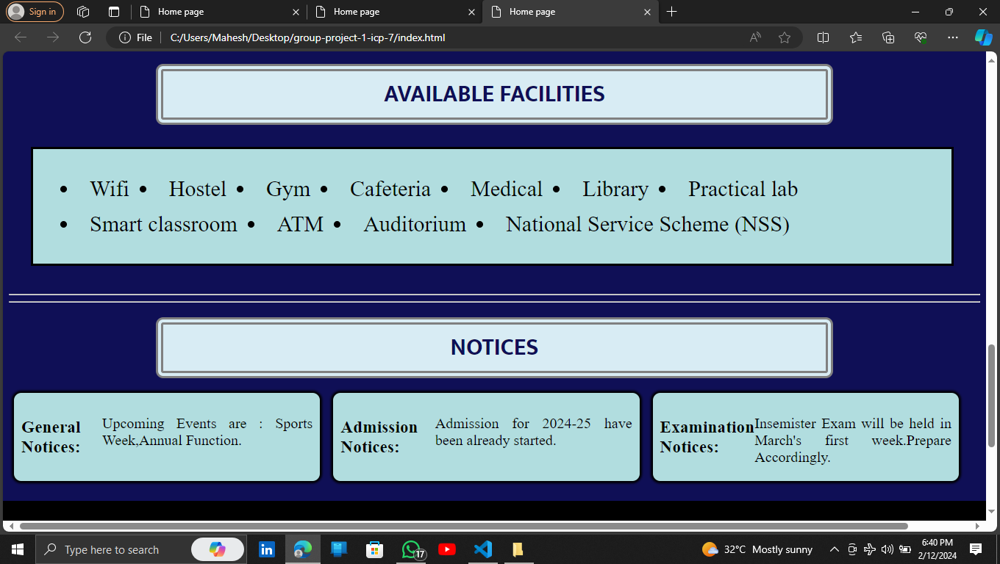
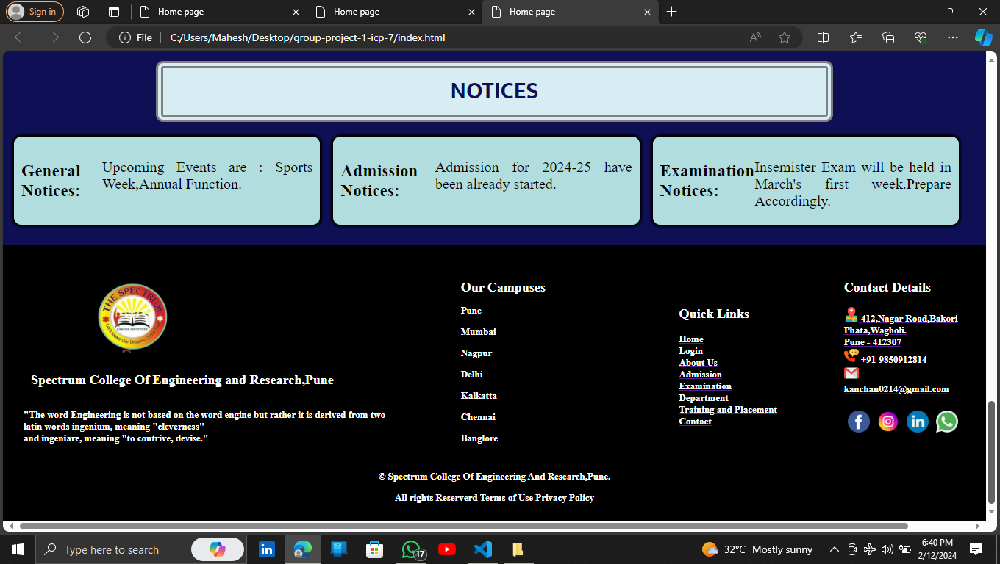

# Project-Name: college_website_project-1_icp7.0

---
# Project-Title: College Website

---
Welcome to the College Website repository! This website is designed to showcase information about a college, including details about programs, admissions,departments and contact information. Feel free to explore the different pages and learn more about what the college has to offer. If you have any questions or suggestions, please don't hesitate to reach out. Enjoy your visit!
This Project is simply made by using HTML & CSS. Weather you are Beginner Student to coding or Web Development this repository will be your go to resource for HTML and CSS.

---
## Features
1. Home Page
2. Login Page
3. About Us Page
4. Admission Page
5. Examination Page
6. Department Page
7. Training and Placement Page
8. Contact Us Page
---
### Home Page

---

---

---

---

---

## How to Contribute 🪴💻

We welcome contributions from the community to help us expand and improve this handbook if you would like to contribute follow the steps:

1. Fork the repository to your GitHub account.
2. Make your changes ,add new content or fix the existing issues.
3. Open pull request in this repository.

---
## Contributors

Made With: https://contrib.rocks

